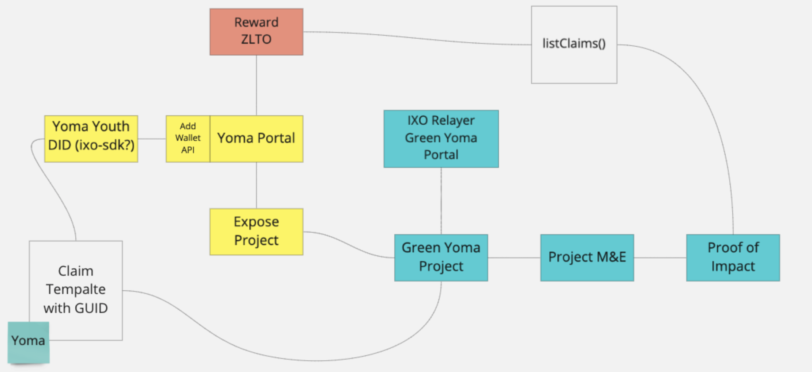

# green-yoma-hackathon

The aim of the green yoma hackatom 2021 is to establish a link between Yoma Platform and Green Yoma (an IXO relayer) so that youth can access impact opportunities and contribute towards projects.

Both Yoma and Green Yoma rely on DID methods to identify and sign verifiable credentials. Yoma use `did:sov` while Green Yoma use `did:ixo`.
The integration between the two platforms start with the DID layer where youth own their wallets and associated DIDs.

Yoma portal already expose the concept of `impact projects`. An integration with the [ixo-client-sdk](https://github.com/ixofoundation/ixo-client-sdk) provide the wallet generation and ixo API integration layer that can be linked to the Yoma API.

The Yoma API will need new API endpoints to manage IXO based wallets:
1. GET - Get Wallet
2. POST - Create Wallet

The Yoma front-end will need an integration with `ixo-sdk` to manage project related aspects:
1. List available projects
2. List available templates for a project
3. Get DID document
4. Create and submit claims
5. List claims polling service for automatic rewards issuance
6. Issue rewards for approved impact claims 
7 Stretch goal - *peer to peer impact verification* -  where youth vouch for each others impact claims. One party act as the impact maker and the other as the impact verifier.
8. Thought - what if we integrate the Yoma SSO capability into IXO? Or even DID auth via the Yoma UI?

Green Yoma impact project management and claim evaluation will initially be provided via the IXO UAT environment available at [ixo-uat](https://app-uat.ixo.world/).
Impact project management:
1. Create projects
2. Define templates
3. Review impact claims
4. Approve/Reject impact claims
5. Communicate and interact with participating youth (support)

**OPTIONS TO CONSIDER:**
1. We can rebrand the IXO mobile app as Yoma
2. Whitelabel IXO as Green Yoma relayer
3. Enable DID auth to Green Yoma relayer
4. Test out alphabond impact funding (bonding curves) on a project
i.e. develop a complete standalone Green Yoma platform with mobile app.

